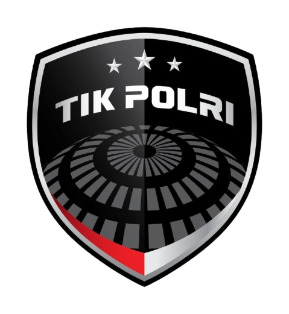
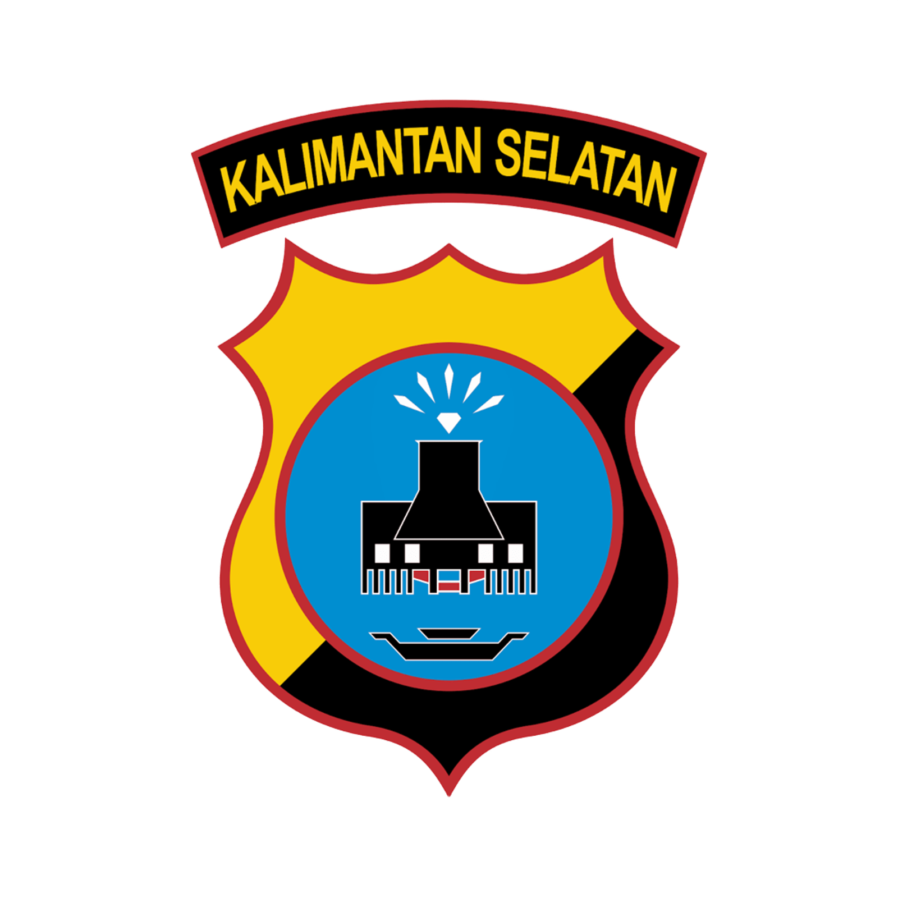
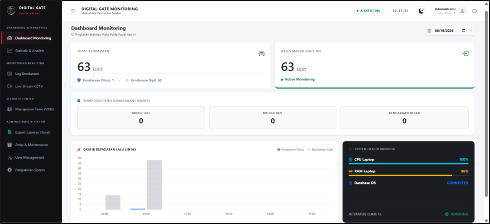
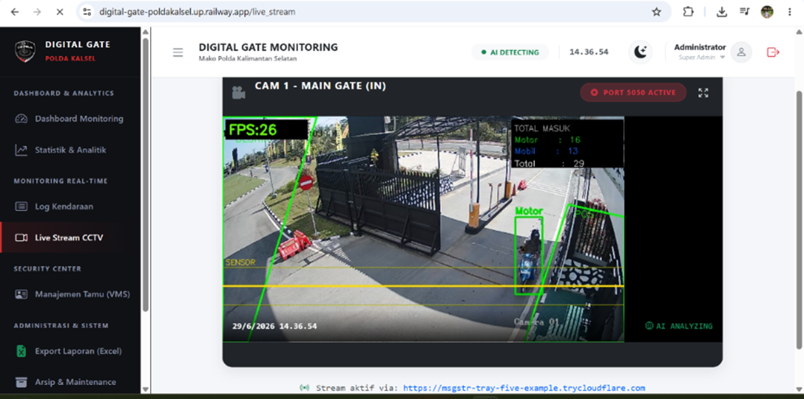
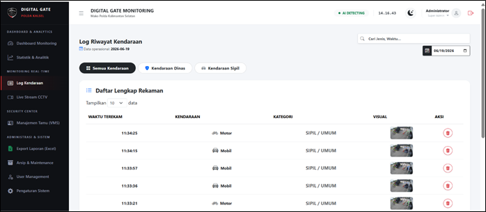
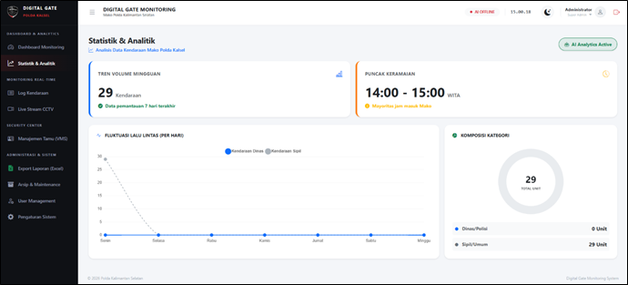

<div align="center">
   &nbsp;&nbsp;&nbsp;&nbsp;
  

  # 🚗 Digital Gate
  ### Vehicle Monitoring System — AI-Based CCTV Gate Detection

  **Sistem pemantauan lalu lintas kendaraan gerbang Mako Polda Kalsel berbasis kecerdasan buatan (YOLOv8)**

  <sub>Dikembangkan selama program Praktik Kerja Lapangan (PKL) — Bidang TIK, Kepolisian Daerah Kalimantan Selatan</sub>

  <br/>

  [](https://www.python.org/)
  [](https://flask.palletsprojects.com/)
  [](https://github.com/ultralytics/ultralytics)
  [](https://www.mysql.com/)
  [](https://railway.app/)
  [](#)

</div>

<br/>

## 📑 Daftar Isi

- [Tentang Proyek](#-tentang-proyek)
- [Fitur Utama](#-fitur-utama)
- [Cuplikan Layar](#-cuplikan-layar)
- [Arsitektur & Pipeline AI](#%EF%B8%8F-arsitektur--pipeline-ai)
- [Teknologi Stack](#-teknologi-stack)
- [Pengujian Sistem (Testing)](#-pengujian-sistem-testing)
- [Struktur Repositori](#-struktur-repositori)
- [Menjalankan Proyek](#-menjalankan-proyek)
- [Keterbatasan Sistem (Known Limitations)](#%EF%B8%8F-keterbatasan-sistem-known-limitations)
- [Kontributor](#-kontributor)

<br/>

## 📖 Tentang Proyek

**Digital Gate Monitoring System** adalah sistem keamanan gerbang otomatis berbasis kecerdasan buatan (AI) yang diintegrasikan dengan kamera CCTV gerbang Mako Polda Kalimantan Selatan. Sistem ini dirancang untuk mencatat lalu lintas kendaraan yang keluar-masuk markas secara otomatis, transparan, dan real-time.

Setiap kali kendaraan melewati garis sensor virtual pada CCTV, sistem secara otomatis akan:
- 📸 **Mengambil Foto Bukti** kendaraan melintas.
- 🕐 **Mencatat Waktu Presisi** (Timestamp).
- 🏷️ **Mengklasifikasikan Jenis Kendaraan** (Mobil R4, Motor R2, Kendaraan Besar seperti Truk/Bus).
- 🚓 **Mengategorikan Status Kendaraan** (Kendaraan Dinas/Polisi vs. Kendaraan Sipil/Umum).

Seluruh log data dan dokumentasi foto dikirim ke server pusat (Cloud) dan disajikan dalam bentuk dashboard monitoring interaktif bagi operator Bid TIK Polda Kalsel.

Sistem ini terbagi menjadi **dua unit terpisah** yang berkoordinasi secara efisien melalui HTTP API:

<table>
<tr>
<td width="50%" valign="top">

**🎥 Unit Deteksi AI (Edge Client)** — [deteksi_ai.py](file:///C:/Users/User/Project_Polda_Kalsel/deteksi_ai.py)
Berjalan secara lokal di komputer gerbang:
- Menangkap stream video CCTV (RTSP).
- Inferensi deteksi & klasifikasi menggunakan YOLOv8.
- Tracking pergerakan objek berbasis IoU dan centroid.
- Mengirim foto bukti & payload data ke cloud API.

</td>
<td width="50%" valign="top">

**☁️ Dashboard Web (Cloud Server)** — [website/app.py](file:///C:/Users/User/Project_Polda_Kalsel/website/app.py)
Aplikasi web Flask yang di-deploy di Railway & MySQL:
- Dashboard status, visualisasi analitik, dan log pencarian.
- Sistem registrasi tamu (Visitor Management System).
- Fitur live streaming video CCTV terenkripsi via tunnel.
- Manajemen akun operator dan arsip basis data.

</td>
</tr>
</table>

<br/>

## ✨ Fitur Utama

| Simbol | Fitur | Deskripsi |
|:---:|---|---|
| 🤖 | **Deteksi & Klasifikasi AI** | Deteksi multi-class kendaraan (R2, R4, Besar) secara real-time dengan model YOLOv8 kustom. |
| 📊 | **Dashboard Analitik** | Grafik statistik volume kendaraan harian/mingguan dan persentase jenis lalu lintas. |
| 📋 | **Log Lalu Lintas Lengkap** | Riwayat deteksi kendaraan terperinci yang dapat difilter berdasarkan tanggal dan jenis, lengkap dengan foto bukti. |
| 📹 | **Live Stream Tunnel** | Streaming video gerbang langsung ke dashboard web dari perangkat edge menggunakan terowongan aman. |
| 🧑‍🤝‍🧑 | **Manajemen Tamu (VMS)** | Pencatatan data tamu dinas/umum yang berkunjung ke Polda Kalsel beserta status aktifnya. |
| 🗄️ | **Arsip Otomatis & Pembersihan** | Fitur pemeliharaan database dan file foto (cold storage) untuk menjaga performa server. |
| 🔐 | **Keamanan Akses (RBAC)** | Pembatasan hak akses fitur antara Operator Biasa dan Super Admin (Bid TIK). |
| 📤 | **Ekspor Laporan Excel** | Pengunduhan data riwayat lalu lintas kendaraan langsung ke format Excel. |
| 💓 | **Heartbeat Telemetri** | Pengiriman data beban CPU, penggunaan RAM, dan status hidup/mati unit Edge ke Server tiap 3 detik. |

<br/>

## 🖼️ Cuplikan Layar

<div align="center">
<table>
<tr>
<td align="center" width="50%">

<br/>
<em>Dashboard Monitoring</em>
</td>
<td align="center" width="50%">

<br/>
<em>Live Stream CCTV</em>
</td>
</tr>
<tr>
<td align="center" width="50%">

<br/>
<em>Log Kendaraan</em>
</td>
<td align="center" width="50%">

<br/>
<em>Statistik & Analitik</em>
</td>
</tr>
</table>
</div>

<br/>

## 🏗️ Arsitektur & Pipeline AI

```
  CCTV (RTSP) ──► Unit Deteksi AI (Edge, deteksi_ai.py)
                         │
           ┌─────────────┼─────────────┐
           ▼             ▼             ▼
    Capture Thread  Inference Thread  Heartbeat (3s)
           │        (YOLOv8: best.pt)      │
           └──────┬───────┘                │
                  ▼                        │
           Update Tracker                  │
         (IoU + centroid distance)         │
                  ▼                        │
         Cek Garis Sensor Virtual          │
        (75% tinggi frame)                 │
                  ▼                        │
      Filter Zona & Validasi Ukuran        │
                  ▼                        │
         Klasifikasi Kategori              │
       (Dinas / Sipil, R2 / R4 / Besar)    │
                  ▼                        │
      Simpan Foto + Insert ke Queue        │
                  ▼                        ▼
      ─────────► HTTP API ─────────► Dashboard Web (Flask + MySQL, Railway)
        /api/upload_foto                     │
        /api/get_config (sync tiap 30s)       ▼
        /api/heartbeat                  Operator / Admin
```

- **Multi-Threading Edge:** Proses pembacaan kamera (*capture*) dan inferensi kecerdasan buatan berjalan di thread terpisah guna memastikan FPS tetap tinggi dan menghindari latensi input.
- **Sensor Garis Virtual:** Menggunakan garis pemicu horizontal. Objek yang bergerak melewati garis dengan arah tertentu akan memicu pengambilan gambar dan pengiriman log data.
- **Antrean HTTP (Queue):** Data deteksi disimpan sementara di antrean memori lokal untuk menjamin pengiriman data ke server cloud tidak terputus saat koneksi internet mengalami ketidakstabilan sementara.

<br/>

## 🛠️ Teknologi Stack

- **Model AI:** YOLOv8 (Ultralytics) — Dilatih kustom via Roboflow.
- **Pustaka Visi Komputer:** OpenCV (Python-OpenCV) & NumPy.
- **Server Cloud Backend:** Flask 3.0 (Python), Flask-WTF (Proteksi CSRF), Flask-Limiter (Rate Limiting).
- **Manajemen Basis Data:** MySQL (dengan library pure-python `mysql-connector-python`).
- **Infrastruktur Deployment:** Railway Cloud Platform.
- **Tunneling CCTV:** Ngrok / Cloudflared (untuk jalur stream video lokal ke internet publik).
- **Pemrosesan & Ekspor Laporan:** Pandas & Openpyxl.

<br/>

## 🧪 Pengujian Sistem (Testing)

Proyek ini telah dilengkapi dengan rangkaian uji otomatis untuk memastikan keandalan kode sebelum dideploy, yang terbagi ke dalam dua metode utama:

### 1. White Box Testing (Unit Testing)
Menguji keandalan logika registrasi kendaraan (`KendaraanRegistry`) dan pelacakan koordinat objek (`PelacakObjek`) secara terisolasi tanpa memicu dependensi eksternal (CCTV/Database).
- **Framework:** `pytest`
- **File Uji:** [tests/test_kendaraan_registry.py](file:///C:/Users/User/Project_Polda_Kalsel/tests/test_kendaraan_registry.py)
- **Komponen yang Diuji:**
  - Pencegahan deteksi ganda (duplikasi) dalam rentang buffer waktu tertentu.
  - Perilaku sensor virtual saat objek melintas atau baru muncul di bawah sensor.
  - Alokasi pelacakan ID objek baru vs objek lama.
- **Cara Menjalankan:**
  ```bash
  python -m pytest tests/test_kendaraan_registry.py -v
  ```

### 2. Black Box Testing (API Integration Testing)
Menguji respons fungsionalitas API server backend (Flask) terhadap masukan eksternal (skenario telemetri, penarikan konfigurasi, otentikasi login, serta pertahanan brute-force).
- **Framework:** Postman & Newman
- **File Skenario:** [tests/digital_gate_postman_collection.json](file:///C:/Users/User/Project_Polda_Kalsel/tests/digital_gate_postman_collection.json)
- **Skenario yang Diuji:**
  - `GET /api/get_config` (Validasi format JSON konfigurasi RTSP & Ngrok).
  - `POST /api/heartbeat` (Telemetri CPU/RAM server).
  - `GET /api/system_health` (Pemeriksaan kesehatan sistem dari dashboard).
  - `POST /login` (Percobaan login gagal & proteksi pembatasan akses/Rate Limiter `5 requests per minute`).
- **Cara Menjalankan (Newman CLI):**
  ```bash
  npx newman run tests/digital_gate_postman_collection.json
  ```

<br/>

## 📁 Struktur Repositori

```
├── deteksi_ai.py              # Kode utama unit deteksi AI (Edge)
├── run_mocked_server.py       # Peluncur server Flask lokal dengan database tiruan (Mock DB)
├── requirements.txt           # Daftar dependensi Python
├── Procfile                    # File konfigurasi startup server untuk Railway
├── .gitignore                  # Berkas konfigurasi pengabaian file Git
├── docs/                       # Folder dokumentasi gambar / screenshot
│   ├── dashboard-monitoring.png
│   ├── live-stream.png
│   ├── log-kendaraan.png
│   └── statistik.png
├── tests/                      # Folder rangkaian pengujian sistem
│   ├── conftest.py             # Konfigurasi mock pytest untuk impor aman
│   ├── test_kendaraan_registry.py # Kode pengujian unit pytest
│   └── digital_gate_postman_collection.json # Kumpulan tes API Postman
└── website/                    # Direktori aplikasi server Flask (Cloud)
    ├── app.py                  # Logika routing, database, dan middleware Flask
    ├── config.json.example     # Contoh template konfigurasi server (aman dari commit kredensial)
    ├── templates/              # File template HTML5 (Jinja2)
    └── static/                 # Aset CSS, JS, Gambar, dan folder foto_kendaraan
```

<br/>

## 🚀 Menjalankan Proyek

### 1. Menjalankan Dashboard Web (Lokal - Tanpa Database Asli/Offline)
Untuk mempermudah pengujian web lokal tanpa perlu menyalakan atau tersambung dengan server database MySQL di cloud Railway, gunakan skrip launcher tiruan (*mocked database*):
```bash
# Masuk ke folder proyek utama
cd C:\Users\User\Project_Polda_Kalsel

# Jalankan server dengan database tiruan
python run_mocked_server.py
```
Aplikasi web Flask akan menyala secara offline di port `5005` (`http://127.0.0.1:5005`).

### 2. Menjalankan Dashboard Web (Lokal - Dengan Database Asli)
Jika ingin menyambungkan langsung dengan database MySQL Railway asli:
1. Pastikan Anda memiliki berkas `website/.env` yang memuat kredensial database asli.
2. Jalankan perintah berikut:
   ```bash
   cd website
   python app.py
   ```

### 3. Menjalankan Unit Deteksi AI (Edge)
Untuk menjalankan program deteksi di gerbang:
1. Copy template `website/config.json.example` menjadi `website/config.json`, lalu isi dengan alamat RTSP kamera CCTV Anda.
2. Jalankan perintah:
   ```bash
   python deteksi_ai.py
   ```

<br/>

## ⚠️ Keterbatasan Sistem (Known Limitations)

- **Desain Kamera Tunggal:** Sistem ini dikonfigurasi untuk menangani 1 CCTV utama (Pintu Masuk); perlu pengembangan skema database untuk mendukung multi-kamera.
- **Ketergantungan Tunneling Gratis:** IP/URL streaming menggunakan Ngrok paket gratis yang berubah setiap kali layanan dijalankan ulang.
- **Tanpa Enkripsi Data Transit API:** Komunikasi API antar edge dan cloud server belum menerapkan otentikasi token API / API Key (hanya mengandalkan keamanan kerahasiaan endpoint).
- **Klasifikasi Tipe Kendaraan Terbatas:** Sistem mengklasifikasikan R2, R4, dan Besar, namun belum mencakup identifikasi karakter plat nomor kendaraan (OCR Plat).

<br/>

## 👤 Kontributor

Proyek ini dirancang dan dikembangkan oleh **Muhammad Zainal Haqi** — Mahasiswa Program Studi Diploma IV Teknologi Rekayasa Komputer Jaringan, **Politeknik Negeri Tanah Laut**, sebagai proyek tugas akhir program Praktik Kerja Lapangan (PKL) pada **Bidang Teknologi Informasi dan Komunikasi (Bid TIK), Kepolisian Daerah Kalimantan Selatan**.

---